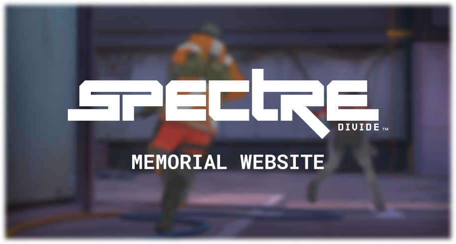

# Spectre Divide Memorial Project

Welcome to the Spectre Divide Memorial Project. Our mission is to preserve the memory of the game and its community by creating an archive that celebrates the games history, community, and impact. Below you'll find information on how you can contribute to this project

# How you can help

## 1. Share timeline events

Help us document the key milestones of Spectre Divide, from its development to its closure. Contributions can include:

- Development Milestones: Information about the game's development phases, beta releases, and official launch dates.
- Updates: Details on patches, new features, or seasons introduced. There was only S0 and S1 so not too much info there
- Community Events: Notable tournaments, community gatherings, or fan-made events.

## 2. Submit Community Media

We aim to showcase the vibrant community that surrounded Spectre Divide. You can contribute by sharing:

- Screenshots: Memorable in-game moments.
- Videos: Gameplay highlights, community event recordings.
- Fan Art: Creative artworks inspired by Spectre Divide.

## 3. Provide Official Materials for the Gallery

To create a well-rounded archive, we seek official content such as:

- Promotional Material: Trailers, posters, or advertisements.
- Press Releases: Official announcements or statements from Mountaintop Studios.

## 4. Assist with Website Development

The project relies on a clean, well-designed website environment to host the memorial. You're welcome to help out if you've got sufficient programming or design knowledge:

- Web Development: Coding and implementing website features.
- Design: Creating an intuitive and visually appealing user interface.

# How to Submit Contributions

Send all design ideas, screenshots, etc. to `@ryukagu08` on Discord.

# Guidelines

- Respect Copyright: Only share content you own or have permission to use.

# Acknowledgments

We extend our heartfelt gratitude to all contributors. Your efforts are invaluable in preserving the memory of Spectre Divide and honoring the community that made it special.

Thank you for being part of this memorial project.
