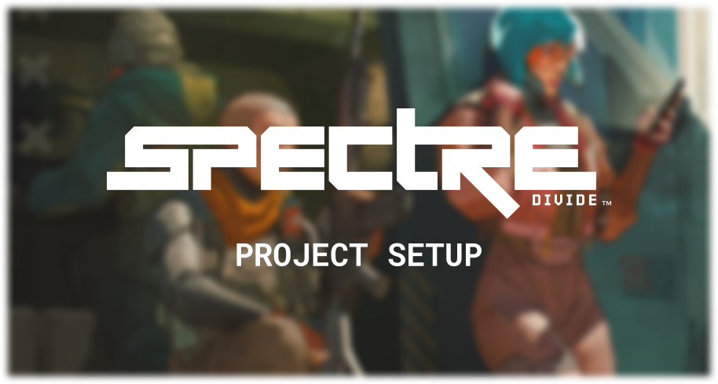

<p align="center">

</p>

# Prerequisites

- Coding knowledge: HTML, CSS, JS & Python
- [Python 3.9 or newer](https://www.python.org/downloads/)

# 1. Clone the repository

```sh
git clone https://github.com/Ryukagu08/SpectreMemorial.github.io.git
```

# 2. Generate data

Refer to [Development -> File Generation](#file-generation) about generating image data.

# Development

## Server startup

We use a few "fancy" features such as file importing in JS so we have to run a https server instead of directly opening the html file

Open a terminal in the project root:

```sh
py python/server.py
```

## File generation

We generate big lists of images instead of having massive html files.

```sh
py python/artwork_generation.py
```
